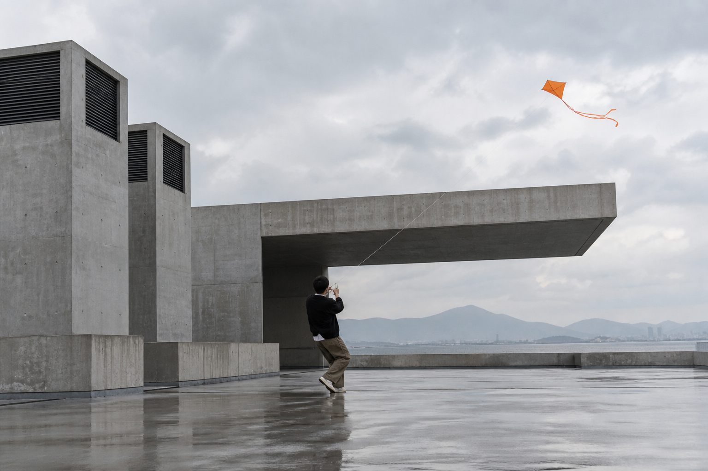
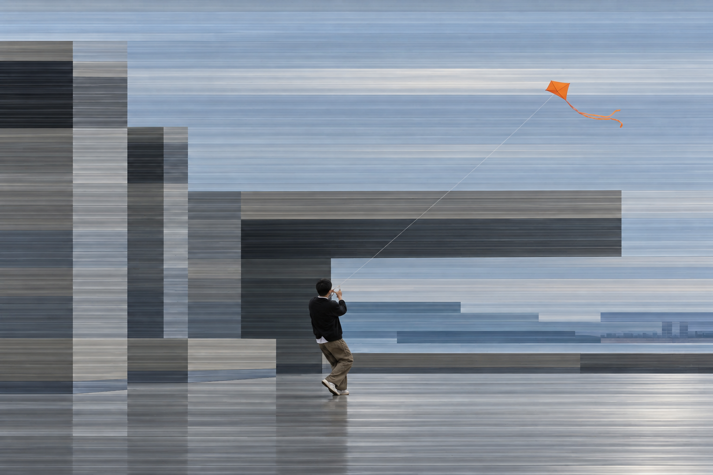
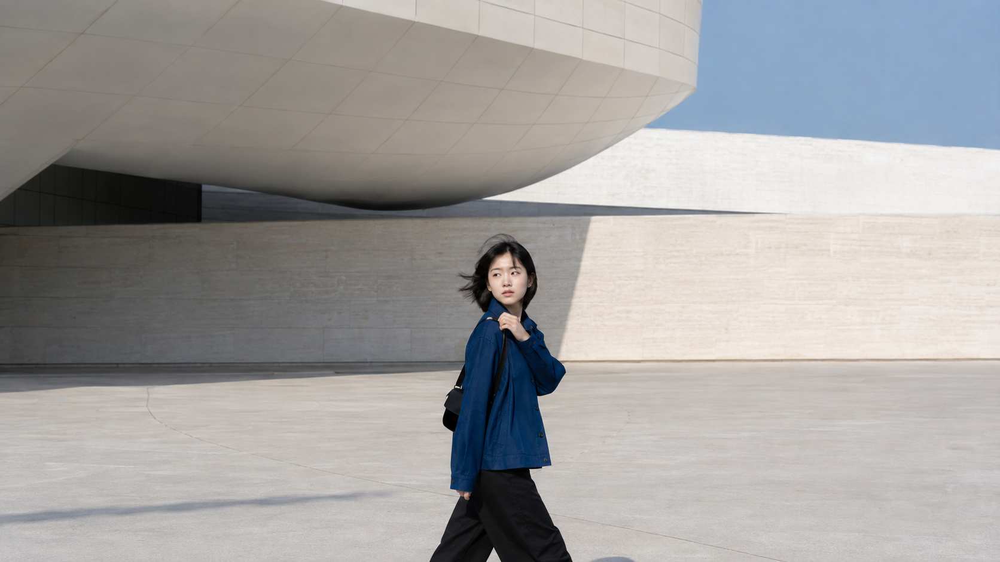
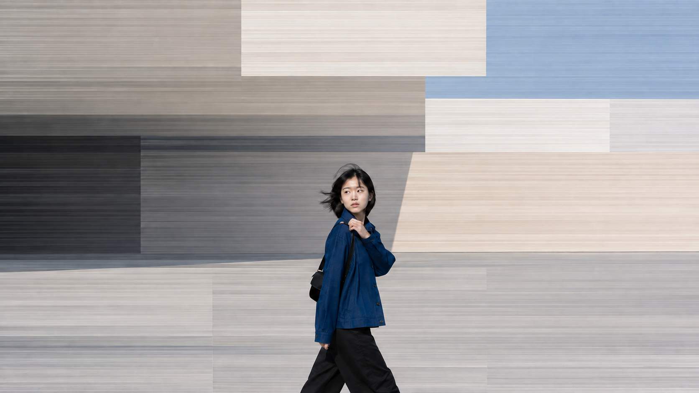
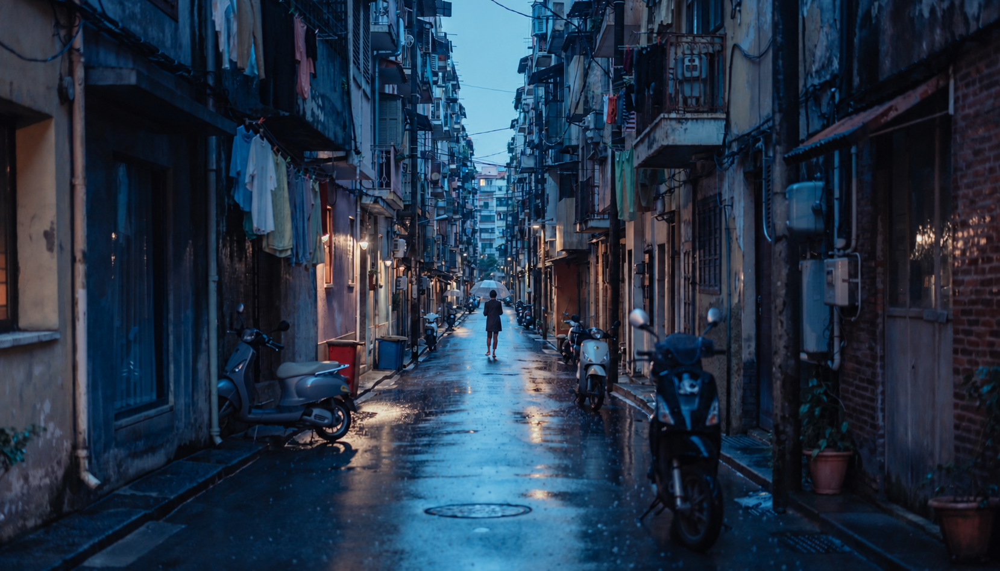
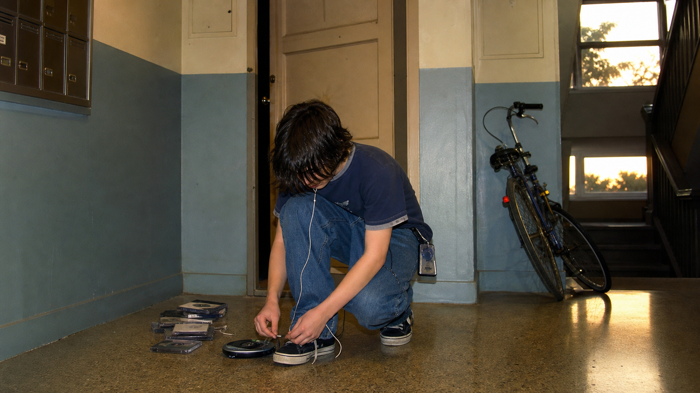
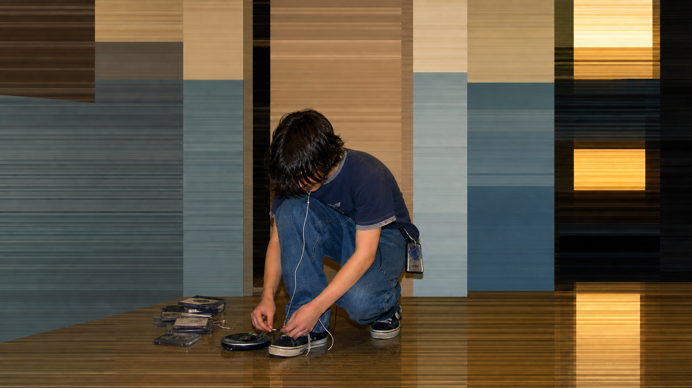
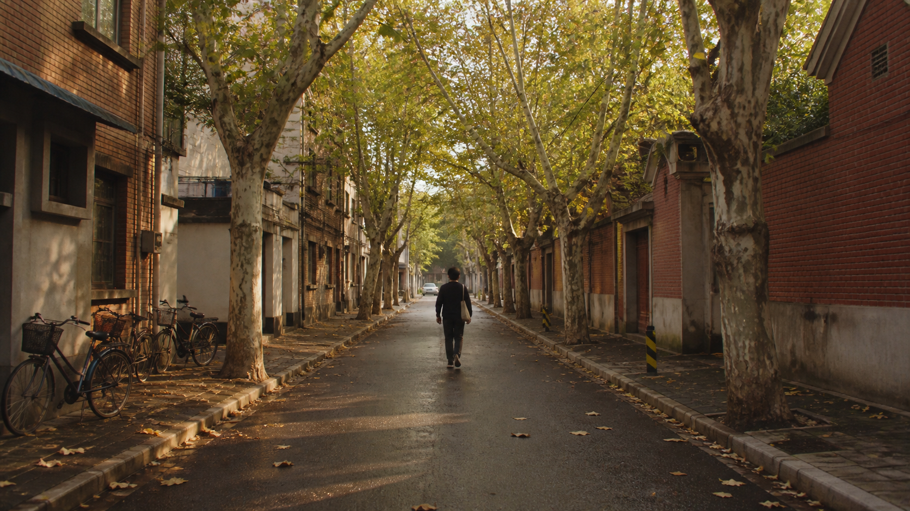
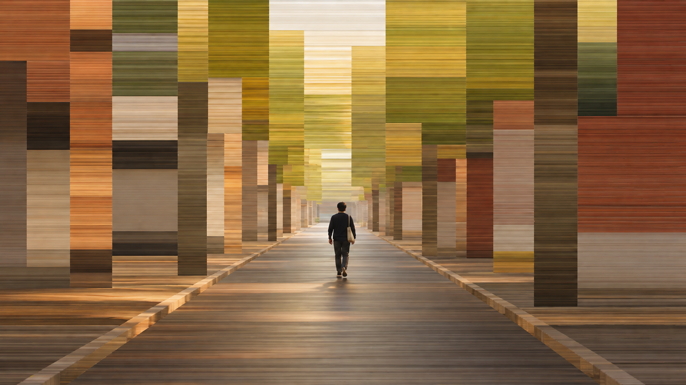

# 城市扫描线幻景

`urban-scanline-mirage` 是一个用于城市、街道和建筑照片的 Codex Skill。它保留人物及其行动关系，把其余环境重构为来源于原图色彩的矩形色域与细密横向扫描线。

## 快速开始

上传一张原图，然后输入：

```text
使用 $urban-scanline-mirage 修改这张照片。
```

Skill 会自动分析主体与空间，调用可用的图像编辑工具生成结果，并在交付前检查人物完整性和扫描线效果。

## 适合的原图

- 城市街道、巷道、市场、车站、广场和桥下空间；
- 现代或老建筑、立面、停车区和公共空间；
- 画面中有一位人物或一个明确行动群组；
- 人物正在步行、等待、骑行、修理、打伞、提物或进行其他可见动作。

## 核心效果

- 人物、动作物品、必要连接、脚下接触区和真实阴影保持摄影质感；
- 天空、地面、建筑和其他背景全部转化，不残留大片写实区域；
- 环境由少量大矩形色域、横条和必要的竖向锚点构成；
- 色彩取自原图，不套用固定配色；
- 每个色域内部使用独立的发丝级横向微层理，而不是全图统一滤镜；
- 缩小看先读到人物和大色域，放大后才能看见细密、清晰的水平色层。

## 结果检查

合格结果应满足：

1. 人物和动作物品没有变形、放大、复制或位置漂移；
2. 原场所仍可通过体块、地平线、色彩节奏和少量锚点被认出；
3. 背景不再依赖车辆、树叶、门窗、灯具等完整自然轮廓；
4. 横线纤细、紧密、低对比、有局部色差，不像 CRT 网格或横向拖影；
5. 天空和地面与建筑具有相同的转化程度，但信息密度更低。

## 生成不理想时

| 问题 | 修正方向 |
| --- | --- |
| 像照片上覆盖横线 | 重新结构化天空、地面和次要物体，不要增加全局线条 |
| 色块太干净 | 在各色域内部增加近邻色变化、局部断点和不均匀层理 |
| 横线像模糊拖影 | 恢复发丝级行层定义，降低柔化和连续涂抹感 |
| 画面像杂乱马赛克 | 合并小碎块，减少色域数量，保留更大的主色区域 |
| 柱子或树干太多 | 合并重复竖向结构，只保留最低限度的空间锚点 |
| 人物发生变形 | 扩大人物与动作物品的保护区域，只重新生成环境层 |

## 在 Codex 中使用

先安装 Skill。

### macOS / Linux

```bash
mkdir -p "$HOME/.codex/skills"
git clone --depth 1 https://github.com/ximisins-collab/urban-scanline-mirage.git "$HOME/.codex/skills/urban-scanline-mirage"
```

### Windows PowerShell

```powershell
$skillRoot = Join-Path $env:USERPROFILE '.codex\skills'
New-Item -ItemType Directory -Force -Path $skillRoot | Out-Null
git clone --depth 1 https://github.com/ximisins-collab/urban-scanline-mirage.git (Join-Path $skillRoot 'urban-scanline-mirage')
```

也可以[下载 ZIP](https://github.com/ximisins-collab/urban-scanline-mirage/archive/refs/heads/main.zip)，解压后把包含 `SKILL.md` 的文件夹放到：

```text
~/.codex/skills/urban-scanline-mirage
```

安装后重新打开 Codex，上传原图并输入“快速开始”中的命令。

### 更新

```bash
git -C "$HOME/.codex/skills/urban-scanline-mirage" pull --ff-only
```

## 在豆包中使用

使用仓库内的[豆包配套包](doubao/使用说明.md)，无需自己编写提示词：

1. [下载 ZIP](https://github.com/ximisins-collab/urban-scanline-mirage/archive/refs/heads/main.zip) 并解压，打开 `doubao` 文件夹。
2. 在支持多图参考的图片编辑对话中，先上传自己的原图，再上传包内的 `固定风格参考.png`。
3. 复制 `城市扫描线幻景-豆包规则.txt` 的全文发送，生成一张结果。

原图决定人物、构图和配色；固定参考图只提供细横线与矩形重构的视觉标准。不要只发送本地图片路径。

这是手动使用的图像编辑规则与参考图，不是豆包原生 Skill 安装包。**豆包效果尚未实测，不保证与 Codex 样片一致。**

## 运行要求

- Codex 需要支持 Skill 调用，并具备可用的 `imagegen` 或等效图像编辑能力；
- 豆包配套用法需要当前入口支持同时上传原图与风格参考图进行图片编辑；
- 本仓库不包含图像模型、API 密钥或生成额度。

## 示例图片

### 1. 风筝与清水混凝土建筑

| 原图 | 生成结果 |
| :---: | :---: |
|  |  |

### 2. 现代建筑中的行人

| 原图 | 生成结果 |
| :---: | :---: |
|  |  |

### 3. 雨夜巷道

| 原图 | 生成结果 |
| :---: | :---: |
|  |  |

### 4. 修理自行车

| 原图 | 生成结果 |
| :---: | :---: |
|  |  |

### 5. 楼道中的随身听

| 原图 | 生成结果 |
| :---: | :---: |
|  |  |

### 6. 林荫街道

| 原图 | 生成结果 |
| :---: | :---: |
|  |  |

## 许可证

[MIT License](LICENSE)
